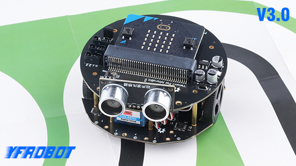

 
# Valon-I V3.0



[Valon is an easy-to-use programming educational Robot](http://www.yfrobot.com.cn/wiki/index.php?title=Valon-I)

[Valon-I](https://item.taobao.com/item.htm?id=635543331286), https://yfrobot.taobao.com/ 

## Basic usage

* Set the direction and speed of Valon motor

```blocks
 valon3.motorRun(valon3.Motors.ML, valon3.Dir.CW, 120)
 valon3.motorRun(valon3.Motors.MR, valon3.Dir.CCW, 120)
```

* Read ultrasonic sensor

```blocks
basic.showNumber(valon3.Ultrasonic(PingUnit.Centimeters))
```

* Stop the Valon motor 

```blocks
valon3.motorStop(valon3.Motors.ML)
```

* Read line tracking sensor

```blocks
valon3.enablePatrol(valon3.PatrolEnable.PatrolOff)
serial.writeNumber(valon3.readPatrol(valon3.Patrol.PatrolLeft))
```

* Turn on/off the LEDs

```blocks
valon3.writeLED(valon3.LED.LEDLeft, valon3.LEDswitch.turnOn)
```

* Read IR sensor value

```blocks
basic.showNumber(valon3.irButtonCode())
```
Support infrared mini controller and [infrared joystick controller](https://item.taobao.com/item.htm?id=623457045218)


## License

MIT


## Supported targets

* for PXT/microbit
(The metadata above is needed for package search.)
